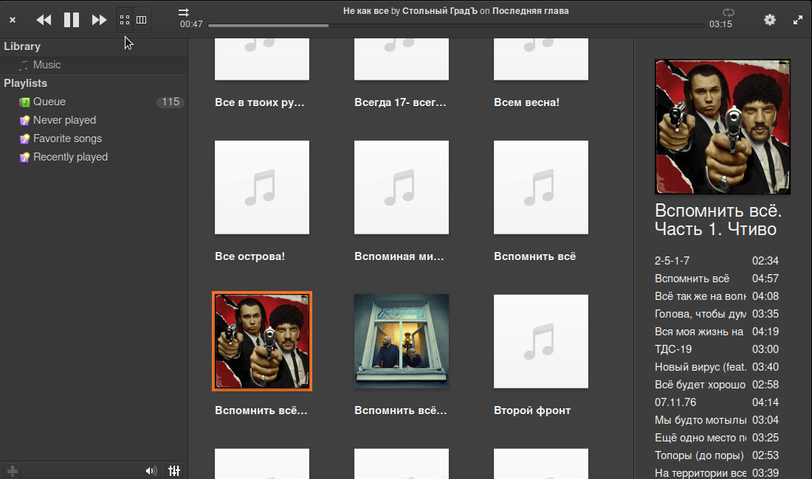

# Music2

The player is not fully stable yet, and the functionality is not fully implemented. But some things is already knows faster and more responsive.

    

----

 </img>

 </img>

## Building, Testing, and Installation

You'll need the following dependencies:
* libdbus-glib-1-dev
* libgee-0.8-dev
* libglib2.0-dev
* libgranite-dev
* libgtk-3-dev
* libgstreamer1.0-dev
* libsqlite3-dev
* libtagc0-dev
* meson
* valac

## How To Build

    meson build --prefix=/usr
    ninja -C build
    sudo ninja -C build install

## TODO

* tag editor
* playlist editor
* smart tracking the availability of tracks
* smart import to the library
